

  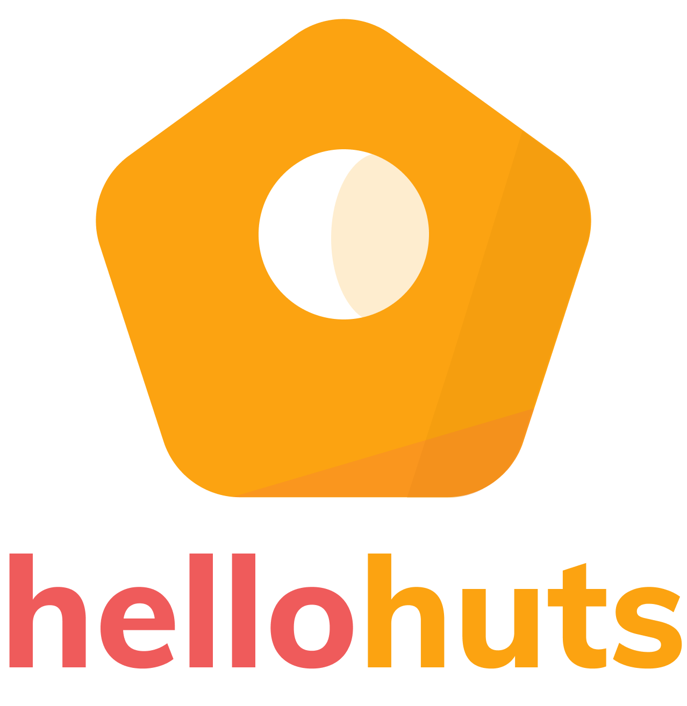

 A production ready tech enabled construction experience built with <a href="https://flutter.dev/">Flutter</a>

 All pages are designed from ground up using <a href ="https://www.figma.com/" > Figma.

  

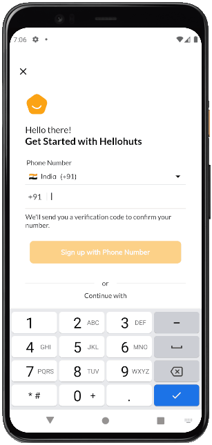
&nbsp;&nbsp;
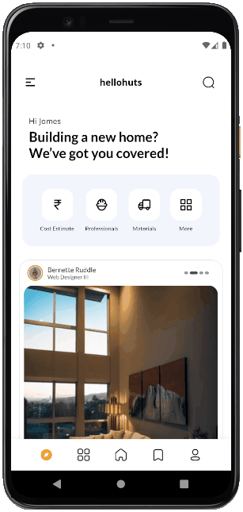
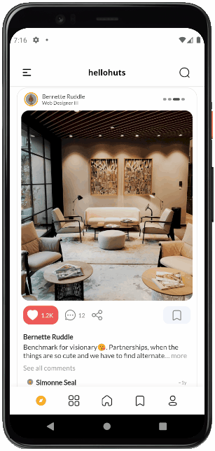

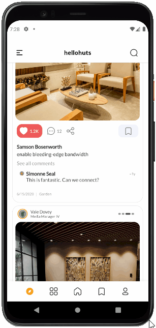

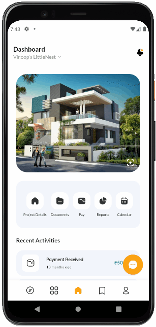
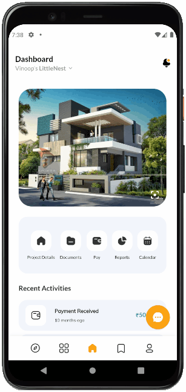

  
  | Like | Share | Theme selection |
  | :---: | :---: | :---: |
  | 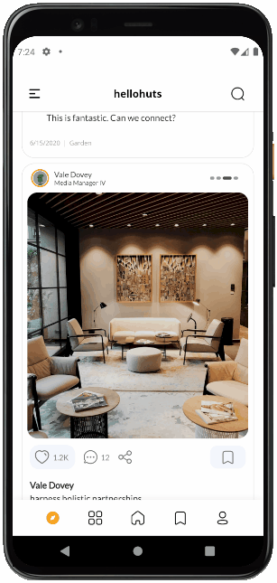 | 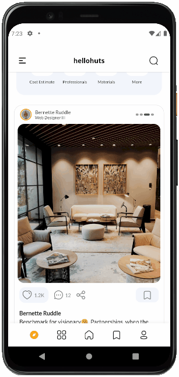 | 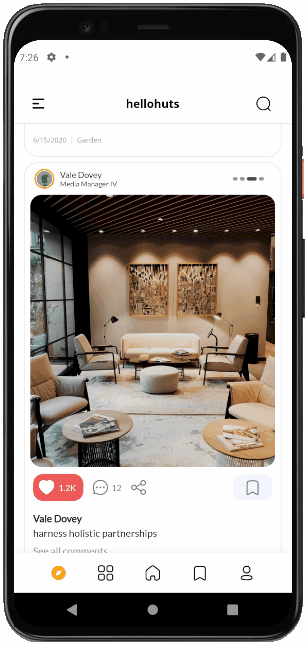 |

  
  | Comment | Follow |
  | :---: | :---: |
  |  | 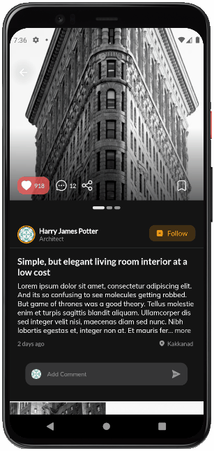 | 

  
  | Selected | Download Documents |  Quick view |
  | :---: | :---: | :---: |
  | 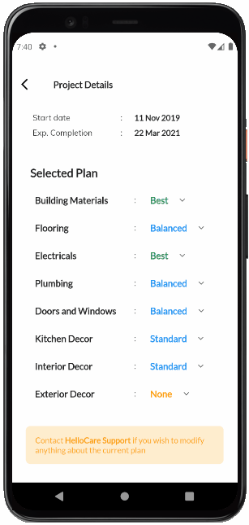 | 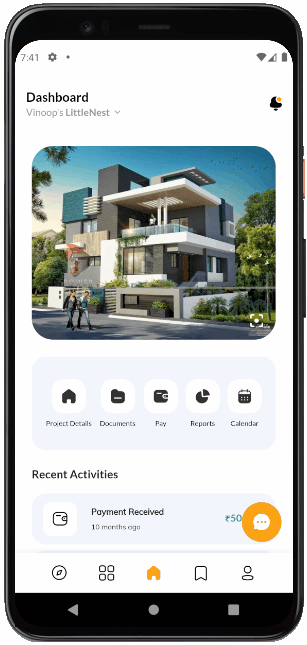 |   | 

 
 Some pages are added in the media folder like notifications, Idea pad etc, Chat Screens etc

 

 
 

# About

Hellohuts is a fully featured application that focuses on great UI/UX and a clean experience.

With this application, we can achieve tech enabled construction experience, fully manange construction and get real time updates.
The idea for this application originated, while I was constructing home for my brother ( Yes, I have a degree in Civil Engineering 😁). 

This application was built with the combination of Flutter with Firebase as backend.

Some interesting features of the app include:

* [provider](https://pub.dev/packages/provider) for the main state management
* [riverpod](https://pub.dev/packages/riverpod) for state management (wanted to try)
* [get_it](https://pub.dev/packages/get_it) as a service provider that includes
  the ability to navigate and to show on screen messages from anywhere in the app.
* [cloud_firestore](https://pub.dev/packages/cloud_firestore) 
* [firebase_auth](https://pub.dev/packages/firebase_auth) 
* [google_sign_in](https://pub.dev/packages/google_sign_in) 
* [sign_in_with_apple](https://pub.dev/packages/sign_in_with_apple) 
* [flutter_facebook_auth](https://pub.dev/packages/flutter_facebook_auth) 
* Fully featured theme customization.
* [flutter_hooks](https://pub.dev/packages/cloud_fiflutter_hooksrestore)  for reducing boilerplate codes
* [flutter_downloader](https://pub.dev/packages/flutter_downloader) for downloading files over internet
* [permission_handler](https://pub.dev/packages/permission_handler) 
* [freezed](https://pub.dev/packages/freezed)  for autogenerate model classes
* [auto_route](https://pub.dev/packages/auto_route)  for routing
* [firebase_analytics](https://pub.dev/packages/firebase_analytics) 
* [timeago](https://pub.dev/packages/timeago) 
* [carousel_slider](https://pub.dev/packages/carousel_slider)  
* [flutter_staggered_grid_view](https://pub.dev/packages/flutter_staggered_grid_view)  

 
 

# Flavors
Hellohuts has three flavors - DEV, QA and PROD. Each should be in separate firebase project

 
 

# Auto Build
Using github workflows, the Hellohuts application can build and deployed. Playstore workflow is also included for future setup

Manually build using  
<code> flutter build apk --release -t lib/main_dev.dart --split-per-abi --flavor dev </code>
# Setup
Include flavor specific google-services.json  or GoogleService-Info.plist in the flavor folders to get started. You may want to add Facebook specifc App Id and Protocol scheme if you want to use Facebook based social login. As the Android requires  all APKs be digitally signed with a certificate before they are installed on a device or updated, we may want to set  up that too. 
 https://developer.android.com/studio/publish/app-signing
Create a file named [project]/android/key.properties that contains a reference to your keystore:

 

# Backend
I am using Firebase as the main backend system for this application, so it eliminates the requirement for any server. All reads and writes to the database is completely protected using strick firebase rules. As per the design, firebases is intended to directly interact with the client, and thats what exacly I am doing here. But no application can completely run on the front end code (I am thinking of payment solutions). I am using cloud functions for processing all the backend logic, which I cant include on the front end. 
 

# Misc

To generate [json_serializable](https://pub.dev/packages/json_serializable)
, [auto_route](https://pub.dev/packages/json_serializable) [freezed](https://pub.dev/packages/freezed):

* `flutter packages pub run build_runner build`

## Created & Maintained By

[Vinoop KS](https://github.com/vinoopks) ([Twitter](https://www.twitter.com/vinoopks))  ([Instagram](https://www.instagram.com/vinoopks)) ([stackoverflow](https://stackoverflow.com/users/11126369/vinoop-ks))
